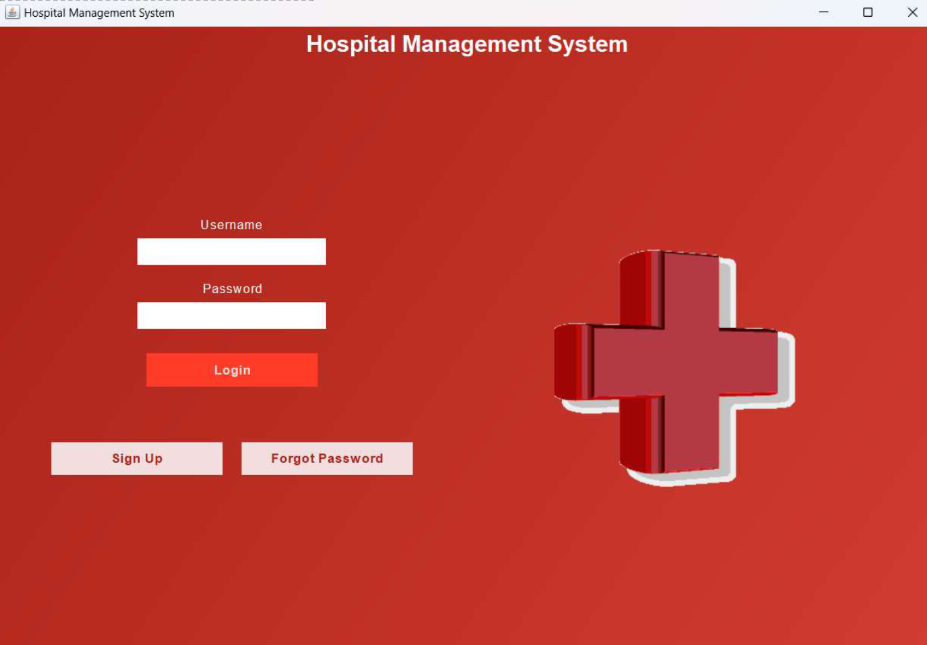
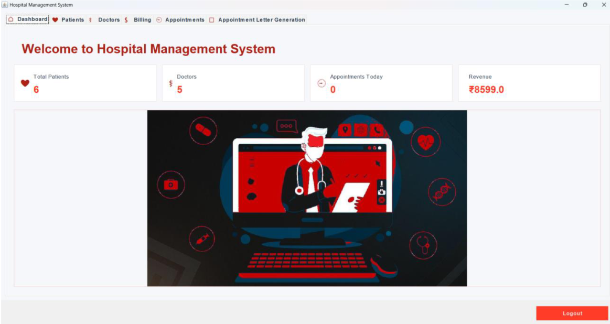

<!-- ------------------------------------------------------ -->
<!--              🏥 HOSPITAL MANAGEMENT SYSTEM              -->
<!-- ------------------------------------------------------ -->

<div align="center">


---

# 🏥 Hospital Management System  
### Java Swing + SQLite Application  


A simple yet complete hospital management solution —  
built using **Java Swing**, **SQLite**, and **iTextPDF** for PDF generation.

</div>

---

## ✨ Overview

The **Hospital Management System** is a desktop-based application created to manage hospital operations efficiently.  
It provides modules for **patients**, **doctors**, **appointments**, and **billing**, with a clean user interface and PDF generation capability.

Designed for demonstration of:
- Java Swing GUI design
- Database connectivity with SQLite
- PDF generation via iTextPDF
- Modular and maintainable code structure

---

## ⚙️ Features

### 🔐 User Authentication
- Secure **Login** & **Signup**.
- Input validation and error handling.

### 🏠 Dashboard
- Centralized control panel with interactive **stat cards**.
- No redirections — all actions from a single interface.

### 👨‍⚕️ Patient Management
- **Add**, **Update**, **Delete**, and **View** patient records.
- Error-free data handling with exception management.

### 🩺 Doctor Management
- **Add**, **Delete**, and **View** doctor details.
- Maintain doctor schedules and availability.

### 📅 Appointment Management
- **Add**, **Delete**, and **View** appointments.
- Generate **Appointment PDF** using iTextPDF.
- **Share Appointment PDF** — opens Gmail compose window locally with:
  - Appointment ID prefilled in subject  
  - User manually attaches the generated PDF

### 💳 Billing System
- Generate bills for patients and appointments.
- Automatically create **PDF invoices**.

---

## 🧩 Tech Stack

| Component | Technology |
|------------|-------------|
| **Frontend** | Java Swing |
| **Backend** | Java |
| **Database** | SQLite |
| **PDF Generation** | iTextPDF |
| **IDE** | Visual Studio Code |
| **OS Compatibility** | Windows / Cross-platform (JDK compatible) |

---

## 🚀 How to Run

1. **Clone this repository**
   ```bash
   git clone https://github.com/NeilLandge/Hospital-Management-System.git

2. **Open the project in VS Code or any Java IDE.**

3. **Add the required libraries:**

    sqlite-jdbc.jar, 
    itextpdf-5.5.13.4.jar


4. **Run the main file:**

     HospitalManagementSystem.java


5. **Start managing hospital operations with ease 🏥**

## 🧠 Future Enhancements

 Automated email notifications

 Improved UI using JavaFX

 Cloud-hosted database integration

## 📸 Screenshots

### Login Page


### Dashboard



👨‍💻 Developer

Neil Landge
🎓 BTech – 3rd Year, Computer Engineering
🤖 AIML Enthusiast | Java & MERN Learner

📫 Contact: neillandge5gmail.com

🌐 GitHub Profile: https://github.com/NeilLandge

📜 License

This project is licensed under the MIT License.
You are free to use, modify, and distribute this project with proper attribution. See the LICENSE file for details.
